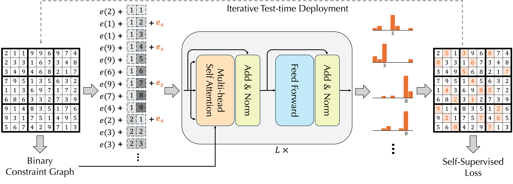

# ConsFormer

Official implementation of:

- [*Self-Supervised Transformers as Iterative Solution Improvers for Constraint Satisfaction* (ICML 2025)](https://arxiv.org/abs/2502.15794)
- [*Large Neighborhood Search meets Iterative Neural Constraint Heuristics* (CPAIOR 2026)](https://arxiv.org/abs/2603.20801)




## Code Structure

```
.
├── requirements.txt
├── analysis.py
├── main_graph_coloring.py
├── main_maxcut.py
├── main_nurse_scheduling.py
├── main_sudoku.py
├── consformer/
│   ├── criterion.py
│   ├── csptask.py
│   ├── embeddings.py
│   ├── modules.py
│   ├── destroy.py
│   ├── solvers.py
│   └── trainer.py
├── data/
├── results/
└── saved_models/

```

**`analysis.py`**  
Model analysis on OOD instances.

**`main_{task}.py`**  
Entry-point scripts for each task (`graph_coloring`, `maxcut`, `nurse_scheduling`, `sudoku`).

**`consformer/criterion.py`**  
Defines loss functions and accuracy/constraint‐violation metrics.

**`consformer/csptask.py`**  
Task-specific data loading, preprocessing and evaluation.

**`consformer/embeddings.py`**  
Embedding layers.

**`consformer/modules.py`**  
Core Transformer building blocks.

**`consformer/destroy.py`**  
Destroy operator implementations (classical and prediction-guided strategies).

**`consformer/solvers.py`**  
The full “ConsFormer” solver class.

**`consformer/trainer.py`**  
Manages training and testing loops.

**`data/`**  
Contains datasets.

**`results/`**  
Output directory for evaluation summaries.

**`saved_models/`**  
Stores checkpointed model weights.

## Usage
Each problem can be run by executing its respective `main` file.

For example, to run the model on Sudoku:
```
python main_sudoku.py
```
You can modify the model/training set up with command line args, for example:
```
python main_sudoku.py --threshold 0.5 --dropout 0.1 --head-count 3 --layer-count 4 --hidden-size 128 --ape-dim 0 --optimizer AdamW --epochs 1000 --loss DecomposedMSE
```
read about the args for each task by using `--help`.

### Decode mode

Decode behavior is controlled via:
- default: sampling decode
- `--greedy-decode`: greedy decode
- `--tau`: decode temperature

### Destroy operator examples (CPAIOR 2026)

Available destroy strategies (`--destroy`):
- `random`
- `greedyworst`, `stochasticworst`
- `stochasticrelated`, `greedyrelated`
- `greedygradient`, `stochasticgradient`
- `greedyconfidence`, `stochasticconfidence`

`--threshold` controls the retained-variable ratio (approximate destroy ratio is `1 - threshold`).

Examples:
```bash
python main_sudoku.py --destroy random --threshold 0.7
python main_sudoku.py --destroy stochasticworst --threshold 0.7
python main_sudoku.py --destroy stochasticconfidence --threshold 0.7 --greedy-decode
```

## Data

You can download the data we used [here](https://drive.google.com/file/d/1WP-g_7yXl0yKSbQkUAaICYVHEpJF7dgH/view?usp=sharing).

## Citation

If you use this code in your research, please cite:
```
@inproceedings{xu2025self,
  title={Self-Supervised Transformers as Iterative Solution Improvers for Constraint Satisfaction},
  author={Xu, Yudong and Li, Wenhao and Sanner, Scott and Khalil, Elias Boutros},
  booktitle={International Conference on Machine Learning},
  pages={69432--69450},
  year={2025},
  organization={PMLR}
}
```

```
@article{xu2026lnsconsformer,
  title={Large Neighborhood Search meets Iterative Neural Constraint Heuristics},
  author={Xu, Yudong and Li, Wenhao and Sanner, Scott and Khalil, Elias Boutros},
  journal={arXiv preprint arXiv:2603.20801},
  year={2026}
}
```

## Contact

Please reach out to [Yudong Will Xu](https://xuwil.github.io/) if you have any questions. 
Slides and Poster of this paper can also be found at this link.
